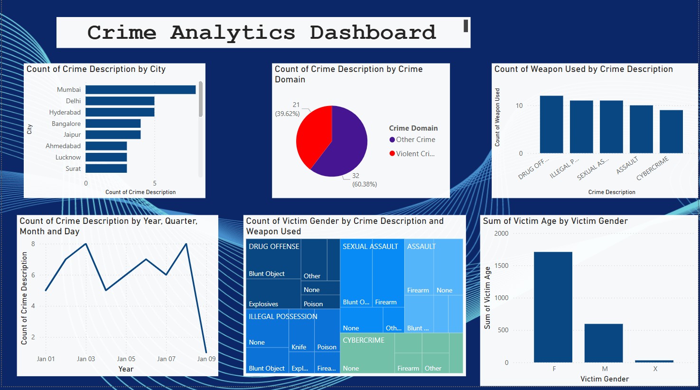
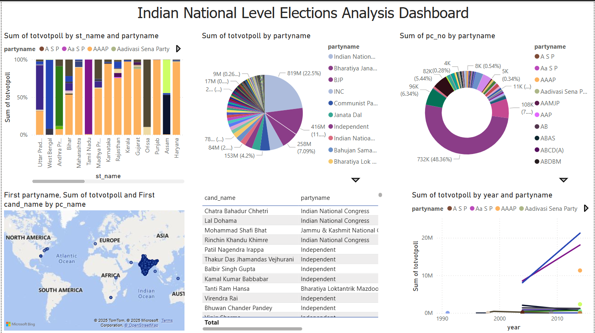
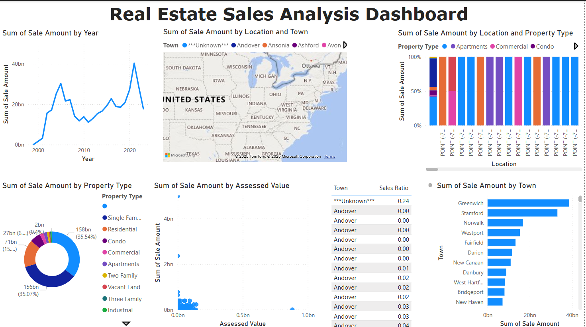
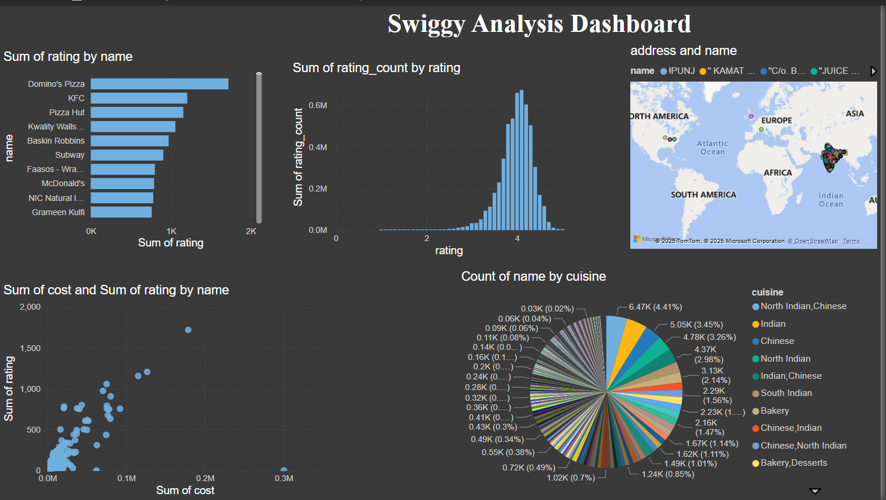

# 📊 Power BI Dashboards by Anand Patel

This repository showcases four end-to-end interactive Power BI dashboards developed to derive actionable insights from various real-world datasets. Each project focuses on a unique domain such as crime statistics, elections, real estate, and food delivery trends.

---

## 📁 Dashboards

### 1. 🚨 Crime Analytics (India)
**File:** `Crime Analytics(India).pbix`

#### 🔍 Overview
This dashboard provides a comprehensive view of crime trends across Indian states and union territories. It allows users to analyze crime patterns by year, crime category, region, and gender distribution.

#### 📌 Key Features
- State-wise and category-wise crime comparison.
- Year-over-year trend lines.
- Crime rates per 1,00,000 population.
- Heatmap visualization to detect high-crime regions.

#### 🖼️ Screenshot  

#### 🗂️ Dataset
- Source: National Crime Records Bureau (NCRB), Government of India
- Format: CSV/Excel

---

### 2. 🗳️ Indian National Level Election Analysis
**File:** `Indian National Level Election Analysis.pbix`

#### 🔍 Overview
This dashboard visualizes historical election data from Lok Sabha elections in India. It highlights trends in party performance, voter turnout, and regional dominance.

#### 📌 Key Features
- Vote share analysis by political party and state.
- Interactive maps showing party-wise seat distribution.
- Voter turnout by year and region.
- Trends in coalition dynamics.

#### 🖼️ Screenshot  

#### 🗂️ Dataset
- Source: Election Commission of India
- Format: CSV/Excel

---

### 3. 🏘️ Real Estate Sales Analysis Dashboard
**File:** `Real Estate Sales Analysis Dashboard.pbix`

#### 🔍 Overview
A data-driven analysis of real estate sales trends across different regions. The dashboard helps stakeholders understand pricing trends, demand distribution, and high-performing agents or locations.

#### 📌 Key Features
- Monthly and yearly sales trend visualization.
- Price per square foot by location and property type.
- Agent performance dashboard.
- Inventory and sales comparison.

#### 🖼️ Screenshot  

#### 🗂️ Dataset
- Source: Kaggle / Real Estate API datasets
- Format: CSV

---

### 4. 🍽️ Swiggy Analysis Dashboard
**File:** `Swiggy Analysis.pbix`

#### 🔍 Overview
A detailed analysis of Swiggy’s customer orders, delivery times, and restaurant performance. This dashboard helps in understanding peak order times, cuisine popularity, and customer satisfaction.

#### 📌 Key Features
- Order trends by time of day and city.
- Average delivery times.
- Top performing restaurants.
- Most ordered cuisines and categories.

#### 🖼️ Screenshot  

#### 🗂️ Dataset
- Source: Mock Data / Public Swiggy Order Logs
- Format: CSV/Excel

---

## 🛠️ Tools & Technologies
- Microsoft Power BI
- DAX for data modeling
- Power Query for data transformation
- Geo Maps, Slicers, Cards, Matrix visualizations

---

## 📜 License
This project is open-source and available under the MIT License.

---

## 🙋‍♂️ Author
**Anand Patel**
